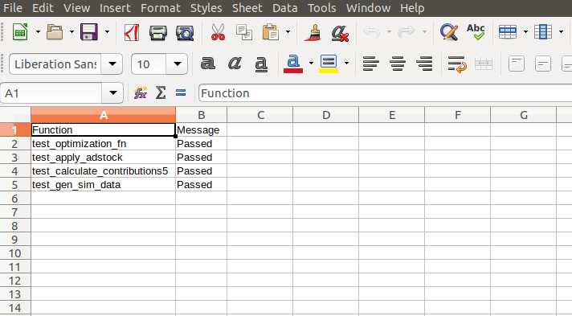
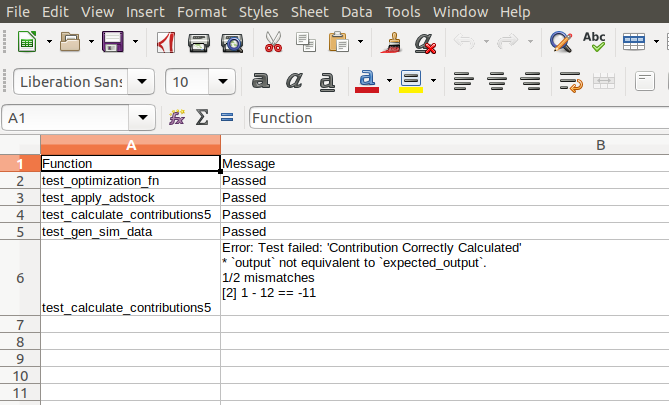

# Test Cases: Marketing Mix Simulation and Optimization Brick

R Shiny brick for simulating/optimizing spend scenarios, comparing their performance and plan for future spending. It has multiple steps that need to be checked everytime we are making changes to the source code. These test cases help us check major functions against predefined standards.

## 1. testCases_folder

This folder contains, all required files like code for test cases, validation datasets
and instruction file. 

### 1.1 R-Code for Test Cases (testCases.R)

We currently have test cases for the following: 

1. Optimization Function (optimization_fn)

2. Adstock Data Transformation (apply_adstock)

3. Contribution Calculation (calculate_contributions5)

4. Data Generation for Scenario 1 (Percentage change from historical pattern) in Simulation (gen_sim_data)

### 1.2 Required Data and Objects (data/)

This folder contains all the supporting documents that may be required in the test cases function. These are custom datasets, RDS objects etc.

## 2 Results (testResults.csv)
Every test case is designed to validate individual functions, these validations are performed on predefined standards/formats already stored in the memory. 

In case a function fails to churn out standard predefined output the error message is stored in the allResults(a list). 

Once you run the entire test code the error results and messages are stored in an csv file at this document location.

Eg.1. Below is how the csv file for the successful test cases look like.

/

\
Eg.2. Below is how the csv file for the failed test cases look like. The message column clearly defines the error message that was thrown when the function was compiled.

