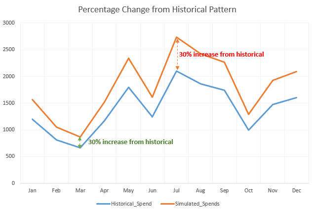
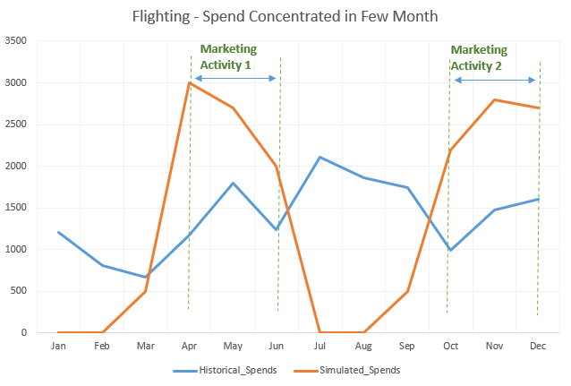

##Objective
This notebook will talk about various simulation and optimization types that are currently available in the MMx Simulation and Optimization Tool.

1. Simulation allows three types of scenarios: 
* Traditional Method : Percentage change from historical pattern 
* Flighting : Spends concentrated in a few months
* Custom Spend Pattern
2. Optimization also allows three types of scenarios: 
* Maximize Sales
* Maximize ROI
* Revenue Chase

## Simulation 
### Traditional Method : Percentage change from historical pattern 
In this method, the budget allocation is done by taking cue from last year's results. This calculation is not completely based on heuristics, phenomena like  yearly inflation, new marketing strategy etc. are taken in to consideration while arriving at a final spend numbers.

{width=50%}

* This method involves generating simulation spend data by adding the percentage increase or decrease over the historical spend pattern
* For example, if for the month of January, in State 1, Channel 1, the spend was $100 and the increment specified is 5%, then the simulated spend for January in State 1, Channel 1 would be $100*1.05 = $105

The uniform marketing is like a "Hello Reminder Technique" where we observe similar intensity marketing throughout the year, this is mostly seen across CPG industry, where one needs to simulate consumer sentiments, for example products like Coke Cola, Chips are not healthy food substitutes but the advertisements are designed to targeted to make need for them in consumer behaviour.

### Flighting: Spend concentrated in a few months
The Flighting method can also be termed a seasonal marketing effort strategy.

{width=50%}

* In this strategy, advertising alternates between running advertising in few months and a complete cessation of all runs in other months
* This method distributes historical spends in the proportions specified by the user for each Panel, Channel and Time point

For a tourism company, lets say Thomas and Cook, most of the advertising spends are concentrated during the months when people plan for their holidays. Usually these seasons are summer holidays, or New Year. This type of spend pattern most of the year, small doses of advertising is done to make people aware about the company and what services company offer to their customers. 

### Custom Spend Pattern
In this method, expenditure at every panel is decided individually. An excel file with predetermined spends can be uploaded into the tool and simulated for result comparison.

## Optimization
There are two optimization algorithm techniques which have been used to make following optimization types available. These are especially chosen derivative free optimization techniques, namely COBYLA (Constrained Optimization By Linear Approximations), ISRES (Improved Stochastic Ranking Evolution Strategy).

* COBYLA is a numerical optimization method for constrained problems where the objective function's derivative is unknown. That is, COBYLA can find the vector that has the minimal (or maximal) f(x) without knowing the gradient of f
* ISRES algorithm for nonlinear-constrained global optimization (or at least semi-global; although it has heuristics to escape local optima

### Maximize Sales 
For this choice of Business Objective, the objective function strives to achieve maximum revenue/ sales through different combination of spend variables.

Maximize Sales is very important Business Objective especially when the primary objective of the company is to increase market share, create new market. During this the allocated budget is directed towards getting more revenue. This strategy is usually at the expense of return over investment. Daily offers like 50% off by Zomato or Swiggy are examples of Maximizing Sales, with little or no money

### Maximize ROI 
For this choice of Business Objective, the objective function strives to achieve maximum return over investment through different combination of spend variables. 

### Revenue Chase  
Revenue Chase is the optimization type currently available in the tool, under this a target revenue is set by the user and objective functions strives to converge to set of spends which take brings us closer to the sales target and finally achieve it. Since this is an iterative process it is time consuming and computationally heavy.

## Reference:
* https://nlopt.readthedocs.io/en/latest/NLopt_Algorithms/
* https://en.wikipedia.org/wiki/COBYLA
 
